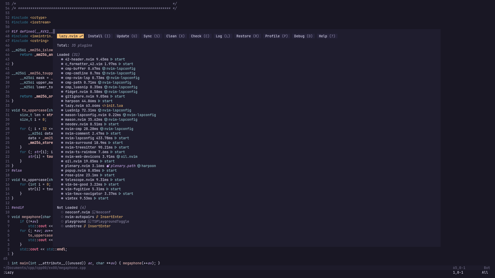

# My Neovim Configuration 🚀

Welcome to my Neovim configuration repository, tailored for 42 students and designed for efficient low-level development in C/C++. This lightweight setup is optimized to provide a seamless coding experience with essential plugins and configurations suitable for resource-constrained environments. 🛠️🎨



## Features 🌟

- **Lazy Loading:** Configurations are optimized for performance with lazy loading of plugins using ```lazy.nvim```.
- **Enhanced Key Mappings:** Streamlined shortcuts to maximize productivity and ease navigation.
- **Visual Enhancements:** Includes the elegant ```rose-pine``` theme, optimized for both light and dark modes.
- **LSP and Autocompletion:** Full setup for Language Server Protocol (LSP) support and smart autocompletion.
- **Developer-Friendly Utilities:** Tools like ```vim-fugitive``` and ```nvim-comment``` integrated for an improved Git and coding experience.
- **42 School Header:** Automatically adds the 42 header to your files using ```42header.nvim``` with the shortcut ```<leader>11```.
- **C Formatter:** Integrated with ```c-formatter-42``` for consistent C/C++ code formatting, accessible via ```:CFormatter42``` command.
- **Navigation Enhancements:** Utilizes ```oil.nvim``` for improved file navigation, including a shortcut ```-``` to quickly move to parent directories.
- **Undo Management:** ```undotree``` managed with ```<leader>u``` to navigate changes and coding history.

## Installation 📦

1. Clone the repository to your desired location:
   ```
   git clone https://github.com/bonsthie/nvim ~/.config/nvim
   ```
2. Start Neovim and the plugins will be installed automatically on first run, thanks to the ```lazy.nvim``` setup.
3. To enable C/C++ formatting, install the C Formatter:
   ```
   pip3 install c-formatter-42 --user
   ```
   The formatter can be found at [c_formatter_42 GitHub repository](https://github.com/dawnbeen/c_formatter_42).

## Usage 📘

- **Key Mappings:**
  - ```<leader>pv``` - Open project files.
  - ```<leader>gd``` - Go to definition.
  - ```<C-d>``` and ```<C-u>``` - Scroll down and up with centering.
  - ```<leader>s``` - Quick substitution in current word.
  - ```-``` - Open parent directory with ```oil.nvim```.
  - ```<leader>u``` - Toggle the undo tree with ```undotree```.

- **Key Mappings 42:**

  - ```<leader>11``` - Insert or update the 42 school header with ```42header.nvim```.
  - ```:CFormatter42``` - format the code at 42 norm

## Customization 🛠

You can customize various aspects by editing the Lua files located in the ```lua``` folder. Each file is segmented to handle different configurations like key mappings, plugin setups, and appearance settings.

Happy Coding! 💻🌈
